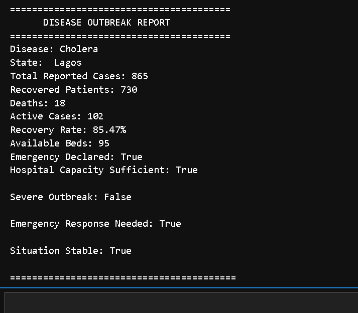
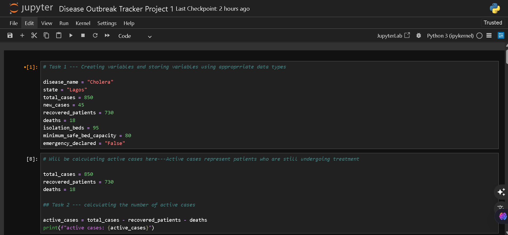
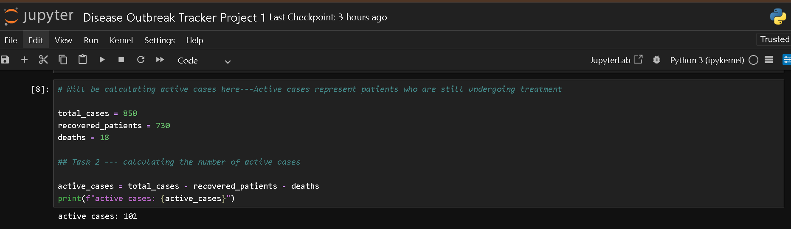
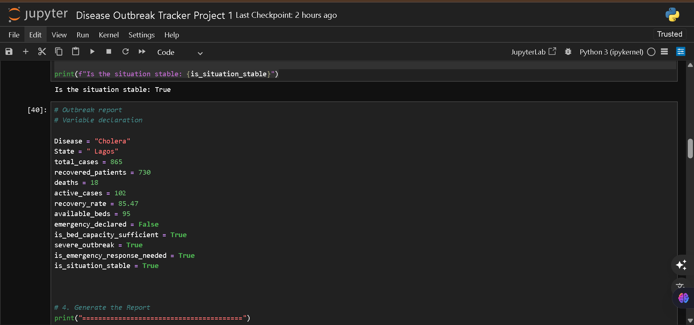
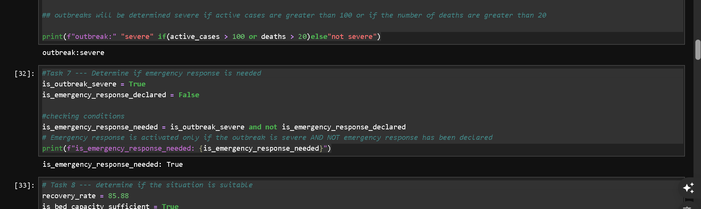
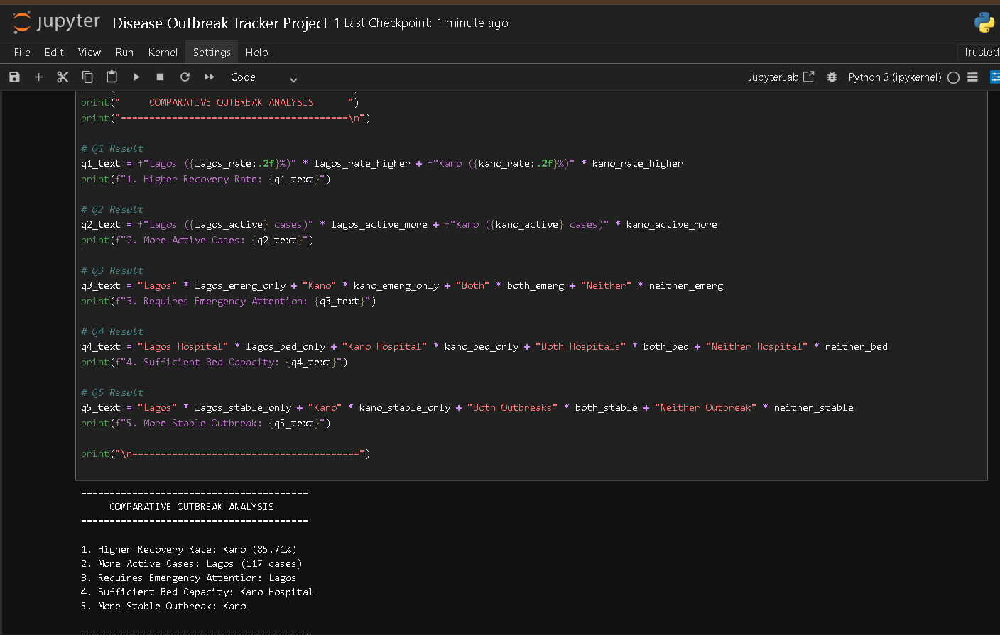

# Disease Outbreak Tracker using Python
<p align="center">

</p>


<p align="center">


</p>

---

# Overview

This project simulates a disease outbreak monitoring system using Python.

It demonstrates how Python can be used to monitor disease statistics, assess outbreak severity, evaluate hospital capacity, and produce epidemiological reports.

The project was built to strengthen my understanding of Python fundamentals while applying them to a real-world public health scenario.

---

# Features

✅ Store outbreak information

✅ Calculate Active Cases

✅ Calculate Recovery Rate

✅ Assess Hospital Capacity

✅ Detect Severe Outbreaks

✅ Recommend Emergency Response

✅ Generate Disease Outbreak Reports

✅ Comparative Outbreak Analysis

---

# Technologies

- Python
- Jupyter Notebook

---

# Project Structure

```
Disease-Outbreak-Tracker-Python/

│── Disease_Outbreak_Tracker.ipynb
│── README.md
│── LICENSE
│── requirements.txt

└── screenshots/
      ├── project_overview.png
      ├── outbreak-data.png
      ├── active-cases.png
      ├── severity-analysis.png
      ├── final-report.png
      ├── comparative-analysis.png
      └── bonus-challenge.png
```

---

# Project Walkthrough

---

## 1️. Creating Disease Variables

The project begins by creating outbreak variables using appropriate Python data types.

<p align="center">

</p>

---

## 2️. Calculating Active Cases

Active cases are calculated by subtracting recovered patients and deaths from the total reported cases.

### Formula

```
Active Cases = Total Cases − Recovered Patients − Deaths
```

<p align="center">

</p>

---

## 3️. Disease Outbreak Data

The application stores outbreak information including disease name, state, total cases, new cases, recoveries, deaths and available hospital beds.

<p align="center">

</p>

---

## 4️. Severity Assessment

The system determines whether the outbreak is severe using conditional statements and Boolean logic.

It also evaluates if emergency response should be activated.

<p align="center">

</p>

---

## 5️. Final Disease Report

After completing all calculations, the system generates a structured outbreak report.

The report contains:

- Disease Name
- State
- Total Cases
- Active Cases
- Recovery Rate
- Hospital Capacity
- Emergency Status
- Situation Assessment

<p align="center">

</p>

---

## 6️. Comparative Outbreak Analysis

The notebook compares outbreaks across multiple locations and answers analytical questions such as:

- Which location has the highest recovery rate?
- Which has more active cases?
- Which requires emergency attention?
- Which hospital has better capacity?
- Which outbreak is more stable?

<p align="center">

</p>

---

##  Bonus Challenge

The project concludes with a bonus challenge that analyses another disease outbreak using a completely different dataset.

This demonstrates code reusability and reinforces Python programming concepts.

<p align="center">

</p>

---

#  Running the Project

# How to View the Project

There are two ways to explore this project:

### Option 1 (Recommended)

Browse the notebook directly on GitHub.

### Option 2

Clone the repository and open the notebook locally.

```bash
git clone https://github.com/Promise-Steve/Disease-Outbreak-Tracker-Python.git
cd Disease-Outbreak-Tracker-Python
jupyter notebook
```
---

#  Skills Demonstrated

This project demonstrates:

- Python Variables
- Data Types
- Arithmetic Operators
- Comparison Operators
- Boolean Logic
- Conditional Statements
- Problem Solving
- Public Health Data Analysis
- Report Generation

---

#  Future Improvements

Potential enhancements include:

- Reading outbreak data from CSV files
- Interactive user input
- Data visualisation with Matplotlib
- Dashboard using Streamlit
- Exporting reports to PDF
- Support for multiple disease datasets

---

# Author

**Somtochukwu Promise Chukwuemeka**

Public Health Professional • Data Analyst • Python Developer

GitHub: https://github.com/Promise-Steve

LinkedIn: https://linkedin.com/in/somtochukwu-chukwuemeka-57b690268

---

# If you found this project helpful, please give it a star!

It encourages me to continue building more data analytics and public health projects.
